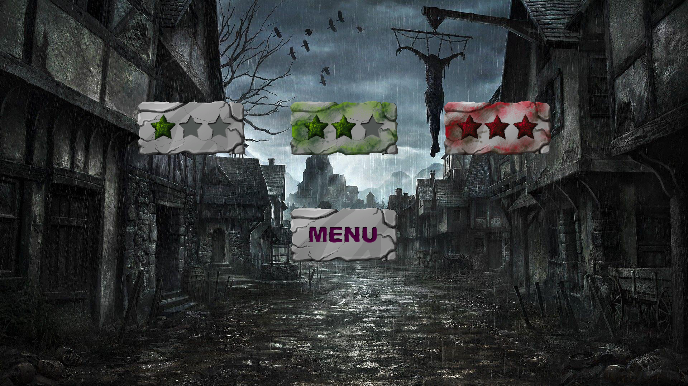
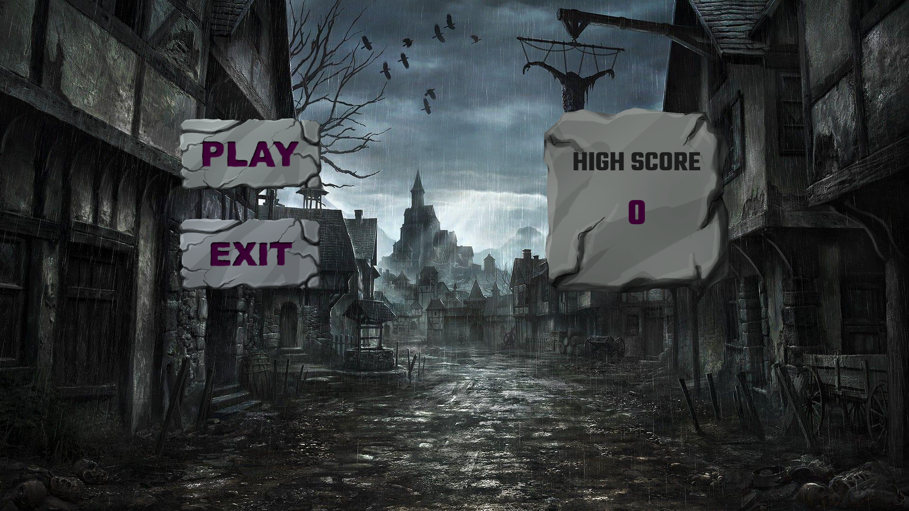
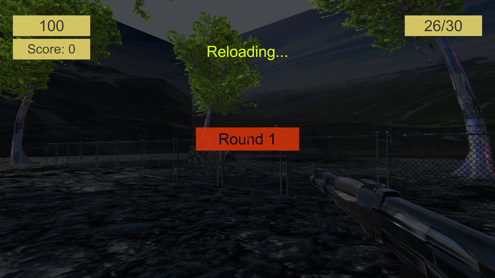
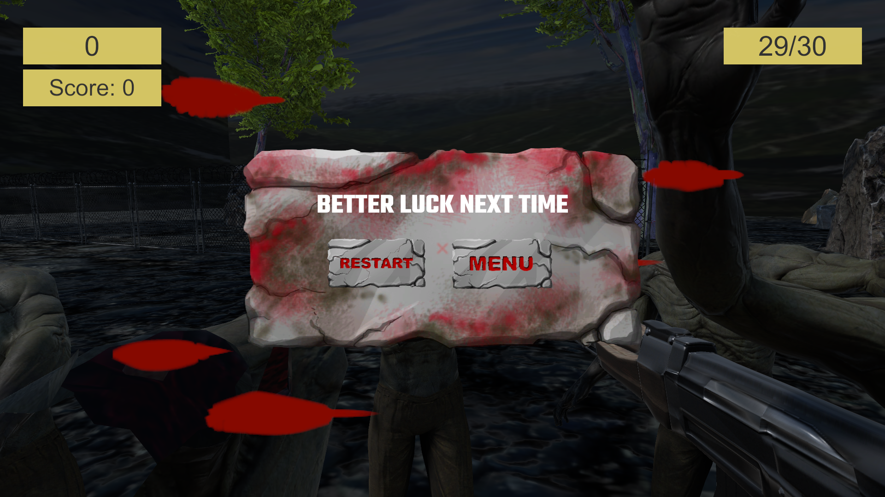

# ZomEndDay #

MINI SHOOTER GAME WITH UNITY

:wave: My Project at OneChain Game :wave:

## Table of Contents
- [Description](#description)
- [Preview Screenshot](#preview-screenshot)
- [Technology](#technology)
- [Functional requirements](#functional-requirements)
- [Contributors](#contributors)
- [License & Copyright](#license--copyright)

## Description
- This is a mini shooting game
- This works well on desktop, and WebGL
- Available demo at itch.io: https://thientmdenk.itch.io/zomendday
- Enjoy :heart:

## Preview Screenshot

  
  </img> &nbsp;&nbsp; 
  </img> &nbsp;&nbsp; 
  </img> &nbsp;&nbsp;
  </img> &nbsp;&nbsp;
  

  
## Technology

- RayCast to Manager Shooting
- Config
- UI, Game, Audio Manager
- Singleton pattern
- State Machine pattern for control Zombie
- NavMesh
- Linerenderer 
- Highscore storage with PlayerPref

## Functional requirements
**1. Player:**
- [X] Menu Interaction
- [X] Moving
- [x] Shooting
- [x] HighScore
- [x] Weapon

**2. Zombie**
- [x] Idle state
- [x] Run toward player state
- [x] Attack player state

## Useful Resources

## Contributors
- [Tran Minh Thien](https://github.com/Denkhotieu) - SE160413 

## License & Copyright
&copy; 2022 TranMinhThien.
